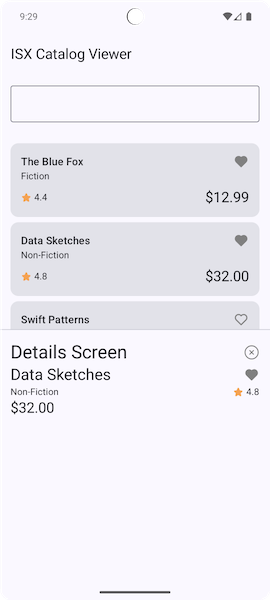
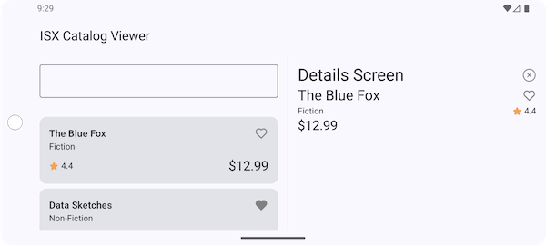

# ISX Catalog Viewer

An Android application for viewing and managing catalog items with favorites functionality, built using modern Android development practices and Clean Architecture.

## Screenshots

<p align="center">
  
  
</p>

## Tech Stack

### Architecture & Design Patterns

The architecture of this application prioritizes modularity, testability, and scalability through 
Clean Architecture principles and feature-based module separation. 
Each feature is split into API and implementation modules, which enforces strict dependency 
boundaries and enables true modular development.

The decision to use MVVM with Clean Architecture creates clear separation between UI logic
(ViewModel), business logic (Use Cases in domain layer), and data access (Repositories in 
data layer). This layered approach makes the codebase highly testable-each layer can be unit 
tested independently with mocked dependencies - and ensures that business logic remains 
framework-agnostic. The trade-off is increased boilerplate: simple features require multiple 
classes across different layers. However, this upfront investment pays off in maintainability 
and scalability as the app grows.

- **Clean Architecture** - Multi-module architecture with separation of concerns
- **MVVM** - Model-View-ViewModel pattern for presentation layer
- **Dependency Injection** - Hilt/Dagger for dependency management

## Project Structure

The project follows a modular Clean Architecture approach with the following modules:

### App Module
- **`:app`** - Main application module that integrates all features and core modules

### Core Modules
- **`:core:common`** - Common utilities and shared code
- **`:core:data`** - Data layer implementation (repositories, data sources)
- **`:core:domain`** - Domain layer (business logic, use cases, entities)
- **`:core:ui`** - Shared UI components and theme

### Feature Modules
Each feature is split into API and implementation modules following the principle of dependency inversion:

#### Catalog List Feature
- **`:features:catalog-list:api`** - Public API and contracts
- **`:features:catalog-list:impl`** - Implementation of catalog list functionality

#### Catalog Details Feature
- **`:features:catalog-details:api`** - Public API and contracts
- **`:features:catalog-details:impl`** - Implementation of catalog details and favorites

#### Home Feature
- **`:features:home:api`** - Public API and contracts
- **`:features:home:impl`** - Implementation of home screen with navigation

### Module Dependencies
```
app
├── core:common
├── core:data
├── core:domain
├── core:ui
├── features:catalog-list:api
├── features:catalog-list:impl
├── features:catalog-details:api
├── features:catalog-details:impl
├── features:home:api
└── features:home:impl
```

## Build Commands

### Build the Project
```bash
./gradlew build
```

### Clean Build
```bash
./gradlew clean build
```

## Run Commands

### Install Debug Build on Connected Device
```bash
./gradlew installDebug
```

### Run the App
```bash
./gradlew installDebug && adb shell am start -n dev.mikhalchenkov.isxcatalogviewer/.MainActivity
```

Or simply use Android Studio's Run button (Shift + F10)

## Testing Commands

### Run All Unit Tests
```bash
./gradlew test
```
